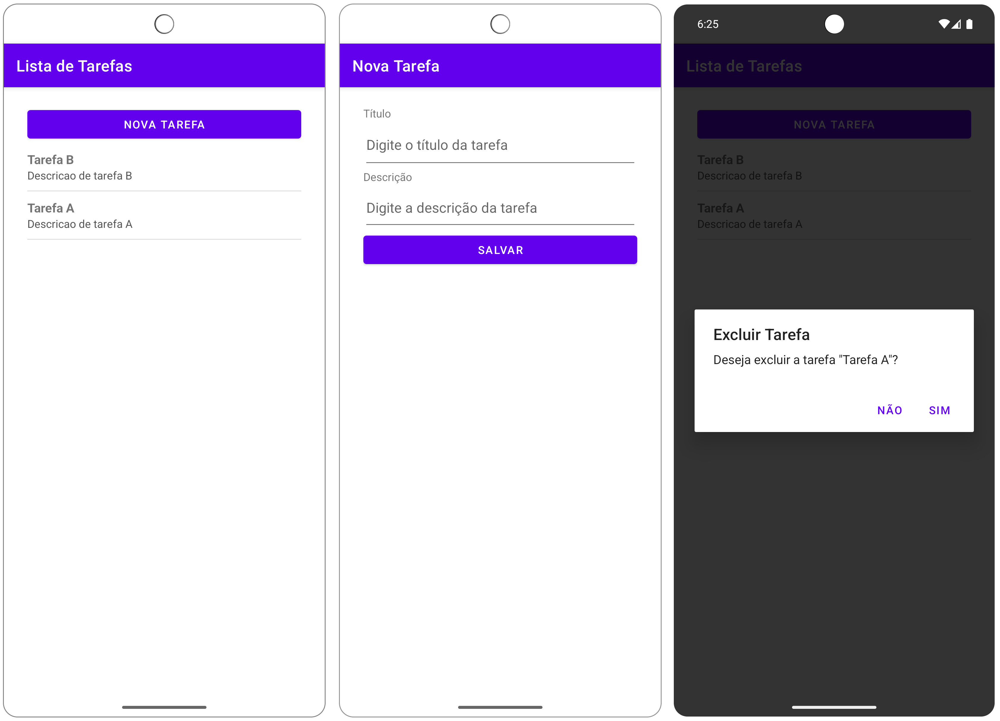
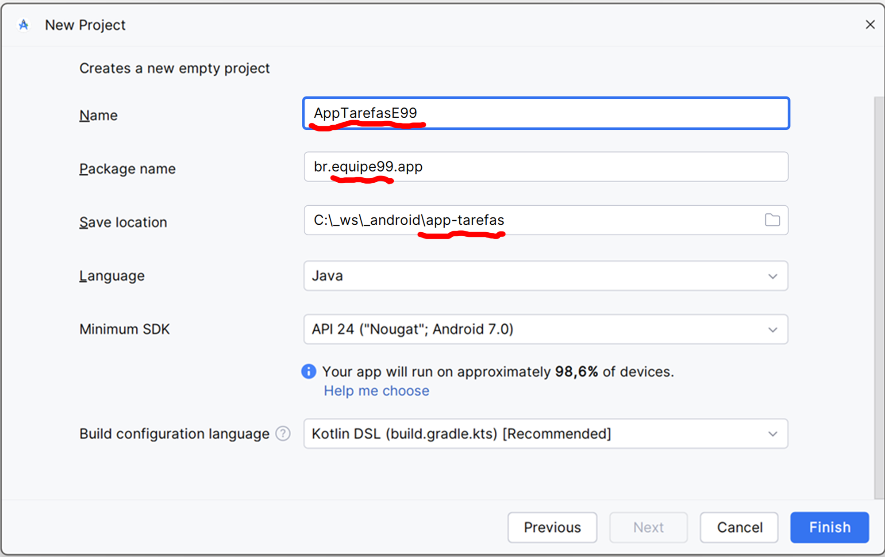
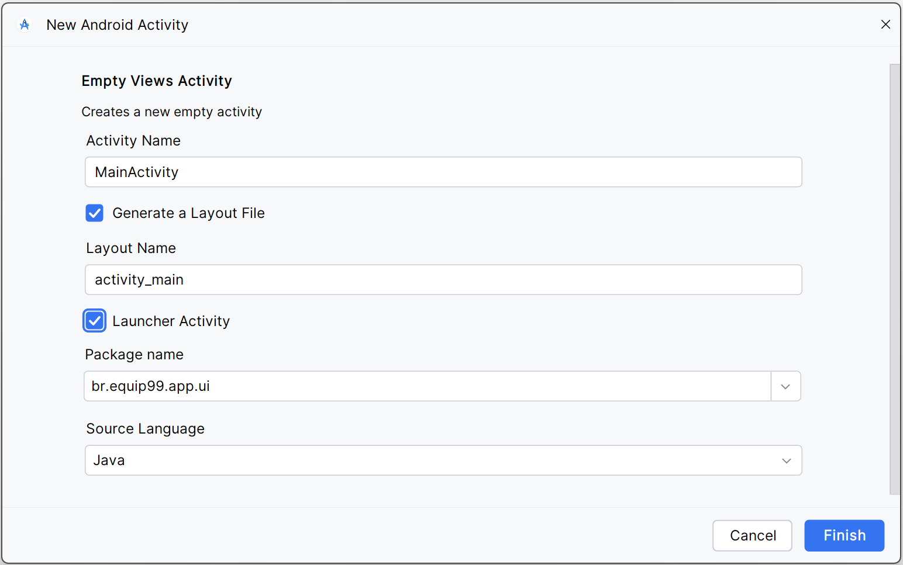

# Atividade avaliativa: CRUD Android (Java + SQLite)

Este repositório contém orientações para o desenvolvimento de um aplicativo de gerenciamento de tarefas que poderá ser utilizado como nota parcial na Avaliação Somativa N2.

O projeto consiste em desenvolver um aplicativo Android **legado**, desenvolvido em **Java**, que implementa um CRUD (Create, Read, Update, Delete) simples para gerenciar a lista de tarefas usando o banco de dados SQLite. O aplicativo deverá ser desenvolvido  seguindo o passo a passo deste tutorial e apresentado no dia da avaliação somativa N2 rodando no emulador ou em um smartphone Android.

# `Atenção: atividade em EQUIPE!`

## Objetivo da atividade
Desenvolver um aplicativo Android (Legado) conforme aparece nas telas abaixo que permita:
- Adicionar tarefa
- Listar tarefas
- Editar tarefa
- Excluir tarefa

### Layout das telas
### 

## Orientações gerais

Regras básicas:
- O  projeto deverá ser construído EM EQUIPE.
- ``Cada commit deverá ser alternado entre os integrantes``.
- Implementar o app conforme descrito neste tutorial.
- Nomear o projeto como **AppTarefasExx**.
- Usar o pacote **br.equipexx**.

Cada equipe deverá desenvolver o aplicativo chamado **AppTarefasExx** (`padrão obrigatório`), onde `Exx` é o número ou codinome da equipe, por exemplo `AppTarefasE01` ou `AppTarefasCodinome` e o pacote `br.e01`ou `br.codinome`. 

# Versionamento de código


`Atenção: só serão considerados válidos os projetos que seguirem estritamente as orientações e etapas de versionamento de códigos especificadas neste repositório.`

O projeto a ser desenvolvido deverá ser versionado, `obrigatoriamente`, em um **Fork** deste repositório e deverá ter os seguintes commits após cada etapa:

1. Criação do AppTarefas
2. Criação da MainActivity
3. Layout da tela principal
4. Layout do item da lista
5. Criação da FormActivity
6. Layout da FormActivity
7. Criação da entidade Tarefa
8. Criação do Data Acess Object (DAO)
9. Criação do Tarefa Adapter
10. Inclusão do CRUD na MainActivity
11. Programação do botão Salvar

## Como fazer *fork* do repositório (GitLab)

1. Acesse a página do repositório **original** no GitLab.  
2. Clique em **Fork** (no topo à direita).  
3. Escolha o **namespace** (sua conta/grupo) e confirme em **Fork project**.  

## Estrutura de arquivos e pastas
```
app/
├── java/
│   └── br.equipexx.ui/
│   │   ├── MainActivity.java
│   │   └── FormActivity.java
│   └── br.equipexx.model/
│   │   └── Tarefa.java
│   └── br.equipexx.db/
│   │   └── TarefaDAO.java
│   └── br.equipexx.adapter/
│       └── TarefaAdapter.java
└── res/
    └── layout/
        ├── activity_main.xml
        ├── activity_form.xml
        └── item_tarefa.xml
```
## Tutorial Passo a Passo

### 1. Crie o projeto no Android Studio
- Nome: **AppTarefasExx** ```Obs.: é obrigatório incluir o número da equipe no lugar de xx.```

- Linguagem: **Java**
- Tipo de activity: **No Activity**
- Package name: `br.equipexx`  
# `Atenção: ao criar o projeto certifique-se de definir o Save Location para o repositório de fork/clone.`

### 

### 2) Adicione os pacotes
```
br.equipexx
 ├─ ui
 ├─ model
 ├─ db
 └─ adapter
```
### 2. Crie a tela principal – `MainActivity.java`
- Adicione uma Empty Views Activity como o nome MainActivity e defina-a como launcher activity.
### 

`Realize o commit obrigatório:`
```
  git add .
  git commit -m "Criação da MainActivity"
  git push
```
### 3. Defina o layout da tela principal – `activity_main.xml`
- Converta o layout activity_main.xml para LinearLayout:
```xml
<?xml version="1.0" encoding="utf-8"?>
<LinearLayout xmlns:android="http://schemas.android.com/apk/res/android"
    xmlns:app="http://schemas.android.com/apk/res-auto"
    xmlns:tools="http://schemas.android.com/tools"
    android:id="@+id/main"
    android:layout_width="match_parent"
    android:layout_height="match_parent"
    tools:context=".ui.MainActivity"
    android:orientation="vertical"
    android:paddingTop="100dp">

</LinearLayout>
```
- Adicione um Button com o nome "Nova tarefa" e defina seu id+ como btnNovaTarefa.
- Adicione uma ListView e defina seu id+ como lvTarefas.
```xml
    <Button
        android:id="@+id/btnNovaTarefa"
        android:layout_width="match_parent"
        android:layout_height="wrap_content"
        android:text="Nova tarefa" />

    <ListView
        android:id="@+id/lvTarefas"
        android:layout_width="match_parent"
        android:layout_height="match_parent" />
```

`Realize o commit obrigatório:`
```
  git add .
  git commit -m "Layout da tela principal"
  git push
```

### 4. Crie o layout o item da lista – `item_tarefa.xml`
- Na pasta res/layout inclua novo arquivo chamado  **item_tarefa.xml** que será usado para cada item exibido no `ListView`.
```xml
<?xml version="1.0" encoding="utf-8"?>
<LinearLayout
    xmlns:android="http://schemas.android.com/apk/res/android"
    android:layout_width="match_parent"
    android:layout_height="wrap_content"
    android:orientation="vertical"
    android:paddingTop="10dp"
    android:paddingBottom="10dp">

    <TextView
        android:id="@+id/tvTitulo"
        android:layout_width="match_parent"
        android:layout_height="wrap_content"
        android:text="Título da tarefa"
        android:textStyle="bold"
        android:textSize="16sp"
        android:maxLines="1"
        android:ellipsize="end"/>

    <TextView
        android:id="@+id/tvDescricao"
        android:layout_width="match_parent"
        android:layout_height="wrap_content"
        android:text="Descrição da tarefa"
        android:textSize="14sp"
        android:textColor="#555555"
        android:maxLines="2"
        android:ellipsize="end"/>
</LinearLayout>
```
`Realize o commit obrigatório:`
```
  git add .
  git commit -m "Layout do item da lista"
  git push
```

### 5. Crie a segunda tela – `FormActivity.java`
- Adicione uma Empty Views Activity como o nome FormActivity.

`Realize o commit obrigatório:`
```
  git add .
  git commit -m "Criação da FormActivity"
  git push
```

### 6. Defina o layout da segunda tela – `activity_form.xml`
- Converta o layout activity_form.xml para LinearLayout:
```xml
<?xml version="1.0" encoding="utf-8"?>
<LinearLayout xmlns:android="http://schemas.android.com/apk/res/android"
    xmlns:app="http://schemas.android.com/apk/res-auto"
    xmlns:tools="http://schemas.android.com/tools"
    android:id="@+id/main"
    android:layout_width="match_parent"
    android:layout_height="match_parent"
    tools:context=".ui.FormActivity"
    android:orientation="vertical"
    android:paddingTop="100dp"
    android:paddingLeft="30sp"
    android:paddingRight="30sp">

</LinearLayout>
```
- Adicione os TextViews, EditTexts e o Button com seus parâmetros.
```xml
    <TextView
        android:layout_width="match_parent"
        android:layout_height="wrap_content"
        android:textSize="20sp"
        android:textAlignment="center"
        android:text="CADASTRO DE TAREFAS"
        android:paddingBottom="20dp"/>

    <TextView
        android:id="@+id/tvTitulo"
        android:layout_width="match_parent"
        android:layout_height="wrap_content"
        android:text="Título" />

    <EditText
        android:id="@+id/etTitulo"
        android:layout_width="match_parent"
        android:layout_height="62dp"
        android:ems="10"
        android:inputType="text"
        android:hint="Digite o título da tarefa" />

    <TextView
        android:id="@+id/txtDescricao"
        android:layout_width="match_parent"
        android:layout_height="wrap_content"
        android:text="Descrição" />

    <EditText
        android:id="@+id/edtDescricao"
        android:layout_width="match_parent"
        android:layout_height="60dp"
        android:ems="10"
        android:inputType="text"
        android:hint="Digite a descrição da tarefa" />

    <Button
        android:id="@+id/btnSalvar"
        android:layout_width="match_parent"
        android:layout_height="wrap_content"
        android:text="Salvar" />
```

`Realize o commit obrigatório:`
```
  git add .
  git commit -m "Layout da FormActivity"
  git push
```

### 7. Criar a entidade – `Tarefa.java`
Representa uma tarefa com `id`, `titulo` e `descricao`.
```java
package br.equipe99.app.model;

public class Tarefa implements Serializable {

    //Desenvolver código...
}
```
`Realize o commit obrigatório:`
```
  git add .
  git commit -m "Criação da entidade Tarefa"
  git push
```

### 8. Criar o DAO com SQLite – `TarefaDAO.java`
- Apenas esqueleto. Desenvolver código principal.
- Classe responsável pelo **acesso ao banco de dados**.
- Estende `SQLiteOpenHelper`.
- Cria a tabela `tarefas`.
- Implementa os métodos:
  - **inserir**
  - **listar**
  - **atualizar**
  - **deletar**

```java
package br.equipe99.app.db;

public class TarefaDAO extends SQLiteOpenHelper {

     //Desenvolver código...
    
}
```
`Realize o commit obrigatório:`
```
  git add .
  git commit -m "Criação do Data Acess Object (DAO)"
  git push
```
### 6. Crie um adapter para a tarefa – `TarefaAdapter.java`
- Apenas esqueleto. Desenvolver código principal.
- Define como cada item da lista será exibido usando `item_tarefa.xml` e herda funções de `ArrayAdapter<Tarefa>`.

```java
package br.equipe99.app.adapter;

public class TarefaAdapter extends ArrayAdapter<Tarefa> {

     //Desenvolver código...
}
```
`Realize o commit obrigatório:`
```
  git add .
  git commit -m "Criação do Tarefa Adapter"
  git push
```

### 7. Adicione as funções de listar, incluir, editar e excluir na tela principal – `MainActivity.java`
- Apenas esqueleto. Desenvolver código principal.

```java
package br.equipe99.app.ui;

public class MainActivity extends AppCompatActivity {

     //Desenvolver código...
}
```
`Realize o commit obrigatório:`
```
  git add .
  git commit -m "Inclusão do CRUD na MainActivity"
  git push
```

### 8. Adicione a função de salvar na segunda tela – `FormActivity.java`
- Apenas esqueleto. Desenvolver código principal.

```java
package br.equipe99.app.ui;

public class FormActivity extends AppCompatActivity {

     //Desenvolver código...
}
```
`Realize o commit obrigatório:`
```
  git add .
  git commit -m "Programação do botão Salvar"
  git push
```

### 9. Rode o aplicativo e teste as funcionalidades
- Inserir nova tarefa.
- Editar tarefa existente.
- Excluir com confirmação.
---

Professor: **Geucimar Briatore**
